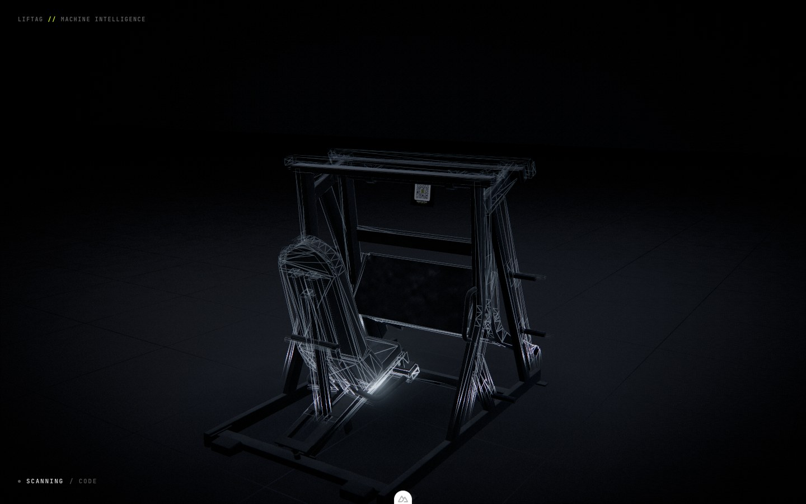

# Gym-scan hero — 3D prototype

A dark-gym WebGL hero built around the LIFTAG product story: **scan a gym
machine → identify it → open it in LIFTAG.** Lives at `/gym-scan` as a separate
route so it can be compared against the live landing page without disturbing it.

```bash
pnpm run dev     # then open http://localhost:3000/gym-scan
```

The route sets `layout: false` (no marketing nav/footer) and `noindex`.



## The sequence

| Scroll | State |
|---|---|
| 0–15% | Near-black room. The leg press is a silhouette on an empty floor running out into fog, with a wire exoskeleton sweeping it top to bottom every 4.4 s. |
| 15–30% | Cursor-driven reveal — a grazing lift along the near edges as the pointer passes. |
| 30–48% | The approach closes; the HUD reports. The sweep retires as the placard takes over. |
| 48–60% | The code plate resolves under analysis, module by module. |
| 60–72% | The approach settles at the seated eye point, facing the placard. |
| 72–86% | The rendered frame folds into a phone-shaped rect. |
| 86–100% | Phone moves right, headline and CTA resolve on the left. |

Under all of it the camera makes exactly **one move**: a single continuous
approach from a wide three-quarter read of the whole machine to the seated eye
point, 6.5 m down to 1.2 m. The states above are things happening *during* that
move, not stages of it.

The closest station is deliberately the athlete's own position rather than a
flattering angle: the whole claim is that you can scan the plate without getting
out of the machine, so the shot that proves it is the one from the seat.

The rest of the gym is empty floor running out into fog. A corridor of
background equipment used to recede behind the hero as real meshes; a
photograph on the far wall stood in later. Both read as clutter or as a
stretched poster. The machine on an empty mat is the shot.

## Files

```
new_app/pages/gym-scan.vue              route
new_app/components/GymScanHero.vue      layout, HUD, phone bezel, final hero
new_app/utils/gymscan/stage.ts          scene graph, lighting, choreography, render loop
new_app/utils/gymscan/machineMaterial.ts  the analysis shader (onBeforeCompile)
new_app/utils/gymscan/hologram.ts       the sweeping wire exoskeleton
new_app/utils/gymscan/composite.ts      grade + the phone fold
new_app/utils/gymscan/placard.ts        the QR sticker material
tools/gym3d/qr_sticker.py               sticker artwork -> texture
new_app/utils/gymscan/environment.ts    procedural env map, fixtures, floor maps
new_app/utils/gymscan/timeline.ts       keyframe/damping helpers
tools/gym3d/*.py                        Blender asset pipeline
```

## Lighting

The room is lit the way the room would be lit, and almost nothing is lit for the
camera. Four things carry it:

**The ceiling strips are area lights.** Two `RectAreaLight`s, 13.5 m long, at
the same positions as the emissive quads the environment map is built from. In a
near-black frame the *shape* of a highlight is most of what the eye has to judge
realism by, and a point or spot light draws a round hotspot on a cylinder, which
is the wrong shape for a room lit by strip fixtures - those draw a highlight that
runs the length of the tube. Matching them to the environment matters as much:
when the reflection and the direct light disagree about where the fixtures are,
the result reads as CG immediately.

**Nothing else is an area light.** They are the expensive kind - the LTC
integration runs per fragment per light, and the floor plane alone covers most of
the screen. Measured with a `EXT_disjoint_timer_query_webgl2`, four of them were
about half the frame. The rest of the rig is spots, because everywhere else the
source is a soft pool where a spot is visually indistinguishable and an order of
magnitude cheaper.

**Ambient is a floor, not a fill.** A constant added term is direction-free by
definition; any real amount of it flattens the shading the area lights exist to
produce. It sits at 0.055 and the environment map does the filling.

**Two colour temperatures.** A warm practical on the side wall gives the frame
tubes a cool edge and a warm edge instead of a single grey ramp. It exists only
in the environment map, with no matching light in the scene: as a real light it
laid a hard orange pool across the floor that announced itself as a coloured
lamp, and as environment it does exactly the job it is wanted for, with no
falloff to give it away and nothing to pay per fragment.

**The phone lights the payoff shot.** At the seated station the camera is inside
the frame, looking at surfaces the ceiling cannot reach - physically correct and
photographically dead; that shot came back almost entirely black. The fill is
the phone's own screen: someone scanning a plate holds a lit rectangle up to it
at arm's length, so the pool of cool light on the placard and the fast falloff
around it are what that shot genuinely looks like. It ramps in over the approach
and dies with the fold, so it only exists while there is a phone to emit it.

**The cursor's light touches only the machine.** A point light follows the
cursor field so speculars react to it. It hangs about a metre up and its falloff
reached the floor, laying a pale blue pool on the ground in front of the machine
and picking out every grain of the mat as a highlight — a lamp with no source,
which is precisely what a cursor field must not look like. It is confined to a
render layer only the hero's meshes join, which also states what it is for: the
machine is reacting to you, the room is not.

The composer target is multisampled (4x, dropped on coarse pointers). The machine
is almost entirely thin tube against black, so every silhouette in frame is a
high-contrast edge, and a stair-stepped edge is a louder CG tell than any
material error.

## Surface detail

The hero GLB ships **no UVs and no texture maps**, so everything on it is
procedural and evaluated from world position, injected into the standard material
before lighting - it changes how the surface *responds* to light rather than
being painted on afterwards. A real machine has no uniform surface anywhere on
it, and a perfectly even one reads as CG no matter how good the lighting is.

- **Mesoscale bump** on the shading normal - the scale at which a panel is not
  quite flat and a tube is not quite straight. True micro-texture (powder coat's
  orange peel is a few tenths of a millimetre) is far below a pixel at every
  camera station here, and a normal perturbation below a pixel does not render as
  texture, it renders as crawling aliasing - so the bump carries a `fwidth`-based
  Nyquist fade and sub-pixel detail is represented as roughness instead, which is
  what it physically is.
- **Multi-octave roughness**, which is where the micro-texture actually lives.
- **Dust**, keyed on how far a face points up and nothing else, because that is
  what gravity does. This single term does more for "used equipment" than any
  amount of albedo tuning: it is the only cue in the frame saying the machine has
  been sitting in a room rather than being spawned in one.
- **Grime** creeping up from floor level - shoe scuff, chalk, mop line.

Each material gets its own parameters (vinyl, powder coat and bare steel weather
differently) while still compiling to one cached program, since three keys its
cache on `customProgramCacheKey`, not on uniform values.

The floor gets real maps instead - albedo, roughness and normal, drawn to canvas
at startup so they cost nothing in either GLB or a request. It used to be
`metalness 0.62`, which gave a clean mirror smear of the ceiling strips: a
showroom look and the single biggest CG tell in the frame. It is now a rough
dielectric, which still returns that reflection at grazing angles through Fresnel
alone, with a fine moulded grain and the tile seams chopping it into something
that has a scale.

Two things about those maps were only settled by rendering them:

- **Recycled-rubber flecks had to come out entirely.** They are correct for the
  material and they were unusable in this room. A fleck is a few millimetres
  across, so at every camera station here it is a sub-pixel patch of different
  roughness — the exact recipe for a specular that flickers on and off with the
  pixel grid. Under near lighting they rendered as a field of bright dots with
  red and blue fringes picked up from the composite's aberration: water beaded
  on the floor, not rubber. Three earlier attempts tried to *tune* them (no
  relief, only-ever-rougher, contrast down) and all three were fixing the wrong
  variable — the problem is the feature size, and no weighting saves a highlight
  that small.
- **Nothing at tile scale can live in the maps at all.** They tile forty-five
  times across the plane, so broad polished traffic patches — the obvious way to
  vary roughness, and what a real mat has — came out as a visible checkerboard
  across the whole floor. All variation above grain scale comes from world-space
  noise in the surface shader, which does not repeat.

## Rendering techniques

**Analysis shader (`machineMaterial.ts`).** The hero keeps a real
`MeshStandardMaterial` and is augmented through `onBeforeCompile`, so PBR
lighting, the env map and shadows stay intact and the effects are added to the
lit result. World position and world normal are injected as varyings at
`<project_vertex>`; the effects are evaluated in world space so they stay
anchored to the machine while the camera moves. Two layers:

- **rim** — a constant faint fresnel edge. This is the thing that keeps the
  silhouette legible when everything else is black, and the only thing on the
  machine that is not the room lighting it.
- **probe** — a cursor-driven field whose boundary is warped by drifting 3D
  value noise, so the reveal behaves like a fluid front rather than a circular
  flashlight. A dim point light follows it so speculars react too, confined to a
  render layer only the hero joins.

There were four. A scan plane swept the machine with a hot core line and a
trailing window of **contour slices**, and a `pow(fresnel, 4)` outline fired for
the identified state. That work was not trivial — the contour field was a tilted
stack of planes blended with shells around the machine's core, each line widened
in *screen* space via `fwidth`, with a gradient-confidence gate and a Nyquist
fade bracketing it, because slicing on world Y alone lit every horizontal member
as a solid bar and thresholding `fract()` directly smeared any face near the
iso-surface into a blob. All of it is gone.

**The reason it went is worth keeping.** The effects were brand lime first. Lime
turned out to read as a green lamp pointed at the machine rather than as
instrumentation, so they were redrawn in the room's cool white — which fixed the
hue and left the real problem standing. An effect drawn across the body of the
machine is a light on the machine whatever colour it is, and this room's entire
premise is that the machine is barely lit. Neutral grey slices over black powder
coat are still slices over black powder coat.

What is actually being scanned is the *code*, not the geometry, so the analysis
lives on the tag now: a per-module dissolve as it resolves. The machine stays
a dark machine and the HUD does the reporting.

**The QR tag (`placard.ts`).** The real printed LIFTAG sticker, not a prop. It
used to be two procedurally drawn canvases — a brushed sign blank with a
QR-shaped pattern on the left and an etched text panel reading `LIFTAG / SEATED
LEG PRESS / ASSET LP-2140 / SCAN FROM SEAT` on the right — and both are gone.
The text panel went because the sticker already carries the wordmark and the
machine name, and a second copy of the same information in a different typeface
beside it is a sign pretending to be a sticker.

*The consequence that matters is that the tag is now lit by the room* rather
than drawn at a brightness of its own. The old plate was deliberately unlit,
because it had to be able to read as a light source once LIFTAG locked onto it.
A vinyl sticker in a near-black gym is a dim, matte, slightly sheeny rectangle,
so the base is now an ordinary `MeshStandardMaterial` at roughness 0.42 and the
analysis is added on top of the lit result through `onBeforeCompile` — the same
arrangement the machine's own surfaces use, for the same reason. It also means
the phone-fill spot finally does something: it is aimed at this tag, and until
the tag was lit it was aimed at an unlit object.

*What the analysis adds is emission from the print itself.* As the code
resolves, the light areas of the tag light up module by module, keyed to a grid
matching the artwork's own 12-pixel module pitch; the dark modules stay dark,
which is what makes it read as a code being decoded rather than a panel being
switched on. It emits in the print's own colour rather than a flat white — the
panel is overwhelmingly white so the shot's colour temperature is unaffected,
and what it buys is the wordmark and the centre logo coming up lime.

Two numbers took getting wrong first. The emissive threshold has to sit at 0.50
linear, not 0.26: the artwork carries a soft glow printed *around* the code
panel and behind the wordmark, and below that threshold the glow emits too,
which is a halo the size of the tag hanging in the air around it. And the peak
emission is about a quarter of white — the first pass ran the panel to ~1.0,
which put the single brightest object in the whole sequence on a sticker, in a
room whose entire premise is that nothing in it is lit.

The sticker is 15.5 cm, applied to a slightly larger blank that sits a
millimetre behind it. The blank is what shows through the artwork's rounded
corners; without something behind them the corners cut through to the scene and
the tag reads as a floating decal rather than vinyl on a surface.

**Hologram exoskeleton (`hologram.ts`).** The one thing the machine does carry
is not on it. A second copy of the hero, 5% larger about its own centre plus a
12 mm normal offset, drawn as nothing but its own triangle outlines, with a
bright horizontal line sweeping it top to bottom for 1.25 s out of every 4.4 s.
The cage resolves behind the line with a 0.55 m exponential trail and dissolves
over the rest of the pass.

*The travel is a damped spring*, `1 - e^(-5t)cos(6.2t)`, not constant velocity.
The line covers the machine in the first quarter of the pass, overshoots the
bottom by about 13 cm — below the geometry, so the overshoot settles rather than
bounces back through anything — and is at rest well before the dissolve
finishes. Linear was the honest choice while this was a plane being dragged
through the machine at a fixed rate; it is not that any more. The cage snaps
into being, which wants an arrival, and constant velocity has none.

*It runs on the stage clock, not on scroll.* An idle that only starts once you
scroll is not an idle. It used to hold off until 16% to leave the opening beat
as a bare silhouette in a dark room — a defensible shot and the wrong trade,
because the first screen is also the only screen a lot of visitors see, and a
machine being scanned while nothing else moves says more about the product than
a machine sitting still.

It is not a counter-example to the paragraph above, it is the shape of the fix.
The objection to the old scan layer was that an effect drawn *across the body*
of the machine is a light on the machine whatever colour it is. A cage floating
a few centimetres off the surface is not on the surface: it occludes nothing, it
fills nothing, and the offset is what makes it read as something projected
around the machine rather than something shining on it. Scaling about the centre
rather than the base is deliberate — it puts the bottom of the shell below the
floor plane, where the floor occludes it, so the machine still reads as planted.

*Outlines, not fill.* The first version shaded the shell with a fresnel and the
seat and backrest came out as solid pale sheets — a ghost machine, which around
a dark machine in a dark room reads as fog. Triangle outlines need a barycentric
attribute, which forces the geometry non-indexed and triples the vertex count;
that is the one thing the shell does not share with the machine. Position and
normal are all it keeps, and the barycentric is three normalised bytes rather
than three floats. Line width is taken from `fwidth` of the barycentric, so it
is constant in *pixels* at any distance, and the whole cage retires where the
triangles fall under about four pixels — below that the outlines merge and it
becomes the fill it was meant to avoid.

*The line has to be far brighter than the cage* — 2.4 against 0.42. It only ever
lights the outlines it crosses, so most of its width falls on empty space
between them; at parity the sweep was invisible and the cage simply grew upwards
with nothing leading it. It also has to stay under about twice that, because the
seat and the roller are broad horizontal surfaces and a plane through them lights
a lot of area at once, which past that point spreads into a wash through the
bloom pass rather than reading as a line.

*It was lime first, and it is not any more.* At this scale the shell is not an
accent, it is a second machine, and a second machine's worth of brand colour
turned the whole shot green — the same failure the analysis layer hit, arriving
by a different route. It is the room's own cool white now, like everything else
that measures.

Under `prefers-reduced-motion` the sweep is replaced by a still cage at a
quarter of its brightness: the idea survives, the repeating travel does not.
Between sweeps the object is `visible = false`, so for most of the scroll it is
not drawn at all; with it frozen fully on, p95 frame time is unchanged from the
scene without it, on this harness, at every scroll station measured.

**Colour discipline: the analysis layer carries no brand colour at all.** It was
lime, tuned down repeatedly, and the tuning was never going to work. Every one of
these terms is *added* over the whole area the effect covers, so its hue arrives
everywhere the effect does — a lime scan does not read as an instrument reading
a black machine, it reads as a green lamp pointed at one, and the more the room
was darkened the more decisively the green won. Structured light in the real
world is white. What separates measurement from illumination is **shape** — thin,
moving, precise, where a lamp is broad and static — and shape is free of the
brightness budget in a way that hue is not.

So the tag's own resolve, the fold's edge bloom, the analysis HUD and the
hologram exoskeleton are all the same cool white as the ceiling strips, and the
machine's own surface effects were removed outright rather than recoloured — see
the analysis-shader note above. Measured across the scene stills before the
sticker landed, green-dominant pixels fell from **2.7% average / 6.3% peak** to
**0.13% peak**. Three-quarters and more of lit pixels are blue-dominant, so the
whole frame sits inside one colour temperature.

**Two things are lime, and both of them are the app rather than the room.** The
printed tag's wordmark and centre logo, which are the brand mark on a physical
object and would be lime in a real gym; and the lock-on reticle's corner
brackets, which are the only piece of chrome in the scene that is unambiguously
LIFTAG talking. Neither is drawn *across* anything — the brackets are four
corners with nothing inside them, and the tag's lime is a few thousand pixels of
print. That is the distinction the whole colour rule turns on: lime names the
product, it never lights the room.

**Every added term is absolute, not relative** — which is the arithmetic that
eventually killed the analysis layer. They are added *to* the lit result, so
every time the room's exposure came down they got louder against the machine and
had to be rescaled to match. Taking the albedo down by half for the darker grade
doubled all of them at a stroke and the scan came back as slabs over a black
machine; the cursor probe was at one point putting twenty times the surface's own
value onto it. An effect that has to be re-tuned every time the lighting moves is
an effect that is fighting the lighting.

The two that remain are both fresnel-weighted for exactly this reason. The rim is
a silhouette edge, not a fill, and the probe is grazing: the point of the cursor
is that the machine *notices* it. As soon as the flat term is large enough to see
on a face it stops being a reaction and becomes a torch, and the darkness goes
with it.

**Check noise frequency in pixels, not in cycles.** The interference burst was
written as 190 cycles per metre in Y but 26 in X and 24 in Z. That looks fine as
numbers and renders as 5 × 36 pixel slabs at the stations that matter, because
the sequence spends its whole second half within a metre of the machine.
Interference is speckle; a slab is a wash.

**How dark, measured.** The darkening pass sampled the same pixels in the
establishing frame before and after (0–255 luminance): frame tube 18.4 → 10.0,
top rail 37.9 → 25.8, backrest 32.4 → 5.5, footplate 12.9 → 6.8, floor beside it
12.2 → 25.2. The machine came down by a third to a half everywhere and the floor
roughly doubled. That inversion is the point — the hero is a shape the room's
highlights travel across rather than the brightest object in a black void — and
the backrest's collapse was larger than the rest because it was also carrying a
bug: the resting cursor probe's lime ring landed flat across it, and against
`#060606` vinyl even 0.02 of added lime is an order of magnitude over the albedo.
It was measurably green in every standby frame.

Those figures are **not** comparable to current stills. The establishing station
has since moved from 4.0 m back to 6.5 m, and the rig has come down again since —
exposure 0.96 → 0.82, strips 4.2 → 3.1 nits, ambient 0.10 → 0.055, key 15 → 10,
rims 11/8 → 7.5/5.5, far overheads 24/17 → 13/9. Measured at the widened station
after that cut:

| top rail | frame tube | backrest | seat pad | floor near |
|---|---|---|---|---|
| 9.0 | 7.8 | 3.6 | 3.7 | 21.8 |

Mean frame luminance across the sequence is **8.3** everywhere except the seated
station (12.1), with **0.1–0.9%** of pixels above 40 — down from 1.5–4.5%.
Whole-frame numbers are the ones worth re-checking after any grade change; the
per-region ones move whenever the camera does.

**Environment.** No HDRI ships. A handful of emissive quads stand in for a gym
ceiling (two strip lights, a cold wall bounce, a floor bounce) and PMREM turns
that into the roughness-mipped cube map the standard material samples — one
render at startup, and the exposed steel gets something structured to reflect.

**The phone fold (`composite.ts`).** Rather than cutting from a 3D section to a
DOM hero, the composite pass folds the whole rendered frame into a rounded
rectangle that lands exactly where the DOM phone bezel sits — the scene *becomes*
the phone's screen. The remap is **cover**, not squash: as the rect narrows the
pass samples a correspondingly narrower slice of the scene, so the machine keeps
its proportions all the way in. The bezel stays DOM so it renders crisp.

**Grade.** AgX tone mapping (ACES was tinting the dark powder-coat and clipping
lime), selective bloom at threshold 1.0 so only genuinely hot pixels bloom,
plus vignette, radial chromatic aberration and a dither.

**The dither is a dither, not film grain — and that distinction was a bug.** The
composite runs *before* `OutputPass`, so it works on linear scene radiance with
the tone map and the sRGB encode still ahead of it, and near black that curve is
extremely steep. A constant added there is not a constant on screen: it is
multiplied by the local slope. At the amplitude it was carried at (`0.013`, set
when the room was much brighter) it measured **6.8 levels of noise on a floor
whose own surface detail is 1.9** — nearly four times more noise than texture —
and, because zero-mean linear noise comes out positive-mean through a concave
curve, it was also fogging the blacks by a whole level.

It was reseeded from `uTime` every frame, which is correct for film grain and
wrong for this. A still frame is the one case where the eye integrates nothing
and reads the noise directly, so with the scene at rest the entire floor crawled.
Measured over five frames at a fixed scroll position, mean temporal deviation was
**4.25 on a frame whose mean luminance is 8.2** — the noise was half the picture.

It is now keyed to `gl_FragCoord` (one value per device pixel at any resolution)
and does not animate, and the amplitude is `0.003`. Removing it outright is not
an option: ninety square metres of near-black gradient quantises to 8 bits in
runs of up to **fifty pixels** of identical value, which is visible contouring
across the mat. `0.003` is where the bands break (longest run 4 px) while the
added noise is ~1.5 levels and the black lift is 0.06.

| composite dither | temporal σ | longest flat run | noise over floor detail | black lift |
|---|---|---|---|---|
| `0.013`, animated (was) | 4.25 | 3 px | 6.8 levels | +0.98 |
| `0.003`, static (now) | 0.01 | 4 px | 1.5 levels | +0.06 |
| off | 0.01 | 52 px | 0 | 0 |

The shadow weighting it carried (`0.30 + 0.70 * (1 - smoothstep(0, 0.35, …))`,
"stronger in the shadows where the eye reads it") was inoperative: those bounds
are display-referred and the values are linear, so in a room this dark every
pixel scored ~1.0. It is gone. The transfer curve already weights a flat linear
dither toward the shadows, and more correctly than a hand-written ramp.

**Scroll.** Hand-rolled: one damped progress value drives everything through
keyframe tables in `stage.ts`. No GSAP or Lenis — the codebase already hand-rolls
rAF loops and this keeps the whole choreography readable as one table.

**The camera is shape and schedule, kept apart.** Every other quantity here is
read with `scalarAt`/`vec3At`, which ease in *and* out of each stop. That is
right for a fade and wrong for a dolly: velocity hits zero at every keyframe, so
a nine-stop camera path renders as eight consecutive zooms with a pause between
each — which is exactly what it looked like. The fix is not smaller steps or a
gentler easing, it is separating the two jobs the table was doing:

- `CAM_PATH` is *where* the camera goes, sampled with `vec3HermiteAt` —
  Catmull-Rom tangents on non-uniform knots, no easing inside a segment, so
  speed carries across every control point.
- `cameraU` is *when*, one smoothstep across the whole approach.

The sequence therefore contains exactly two moments of zero camera velocity: the
top of the page, and the end of the move. The path is also monotonic now; it used
to push in to the seated station and then pull back out for the last quarter, and
a reversal is a phase change however smoothly it is interpolated. Holding the
close shot instead meant the placard now fills the frame behind the app card at
the end, so it and the scene fade both retire to nothing rather than part-way.

## Assets

Extracted from the CGTrader *Ultimate 3D Gym Equipment Mega Pack*. The hero is
the **plate-loaded pivot / seated leg press** (`3.003` in the pack), matched to
the staging catalog machine `pivot-leg-press` and exercise `machine-pivot-leg-press`.

The first pass used the pack's pec deck (`veluond (1)`). It has the better
silhouette in isolation, but on a pec deck the athlete sits facing away from the
frame, so the only surface a placard fits on is the top crossbar — above and
behind the head, where nobody sitting in the machine can see it. That undercuts
the entire premise.

The leg press was chosen on ergonomics: the athlete sits facing straight down
the machine's axis, and the frame's front crossbeam is dead in that sight line
with clear air beneath it. The 15.5 cm QR sticker sits on a blank hanging off
that beam on two stand-offs at `(0, 1.255, -0.372)`, 0.93 m from the seated eye
point and 2° above the sight line, with the footplate topping out at y = 0.83 so
nothing occludes it. Camera
positions were verified against the geometry by rendering from the seated eye
position in Blender before any of it was built.

| File | Size | Triangles |
|---|---|---|
| `hero-machine.glb` | 308 KB | 24,551 (5 materials) |
| `qr-sticker.webp` | 12 KB | — |
| Draco decoder (wasm + wrapper) | 245 KB | — |
| **Total over the wire** | **~565 KB** | — |

Drawn per frame: **~50k triangles** — the machine and the hologram shell's own
copy of it — against a 150–200k budget. The shell shares nothing with the
machine because triangle outlines need a barycentric attribute, which forces the
geometry non-indexed; it carries position, normal and three bytes of
barycentric, and nothing else.

`gym-props.glb` is no longer loaded. The file and `tools/gym3d/export_props.py`
are both kept so the corridor can be brought back without re-deriving it from
the pack, but nothing requests it and it is not counted above.

The hero needs no collapse decimation — a planar-dissolve pass on the CAD
tessellation takes it from 28,019 to 24,551 triangles without touching the
silhouette, which is already inside budget.

Materials are analytic PBR with no texture maps, so nothing needs KTX2 and the
GLBs stay small; the surface detail is procedural (see **Surface detail** above)
and the floor's maps are drawn to canvas at startup, so neither costs a byte. All pack materials were replaced with a LIFTAG set — matte
powder-coat frame, near-black moulded detail, vinyl pads, a semi-metallic
footplate and selectively metallic weight horns — which also drops every texture
map, and with it any manufacturer branding that lived in one. Slot roles were
established by rendering the mesh with one flat colour per material slot.

### Reproducing the assets

Requires Blender (`brew install --cask blender`) and the purchased `.blend` at
the repo root:

```bash
blender -b "all+fitness.blend" -P tools/gym3d/inspect.py       # inventory JSON
blender -b "all+fitness.blend" -P tools/gym3d/preview.py       # per-mesh previews (to pick a machine)
blender -b "all+fitness.blend" -P tools/gym3d/export_hero.py -- 1.0
blender -b "all+fitness.blend" -P tools/gym3d/export_props.py
```

Both exporters are deterministic and rewrite the GLBs byte-for-byte.

The QR tag needs no Blender, only the exported sticker artwork:

```bash
python3 tools/gym3d/qr_sticker.py tools/gym3d/pivot-leg-press-qr.png
```

The phone-screen capture after the fold is procedural (the real app's QR
morph, then a Pivot Leg Press log-set replica). Rebuild with
`python tools/gym3d/record-scan-flow.py`. That writes `gym-scan-flow.mp4` +
`.av1.mp4` (keyframes at 0s and 3.2s, `moov` first) and the reduced-motion
still `assets/gym3d/log-set.webp`.

Three things happen in there and the order of two of them matters. The artwork
ships as a rounded-rect sticker on an opaque white page, and the white has to be
killed *before* the downscale — resampled afterwards it leaves a white fringe
around the corner arcs. The corner alpha is then generated analytically at the
output size rather than resampled, so the arc stays clean. Last, the palette
comes down to 64 colours, which is invisible on artwork that is black, white,
lime and antialiasing, and is most of the file: 104 kB in, 12 kB out at
512 x 541, lossless WebP, bit-identical to the quantised RGBA.

> One trap if you extend these scripts: `tools/gym3d/inspect.py` shadows the
> standard library's `inspect` for anything run out of that directory, and numpy
> imports it on the way up. `qr_sticker.py` drops the script directory from
> `sys.path` before importing anything third-party.

> **Licensing.** `all+fitness.blend` and `textures.rar` are the purchased source
> pack and are gitignored (`/all+fitness.blend`, `/textures.rar`, `/.assets-src/`,
> `/.blend-work/`). Do not commit them. `textures.rar` is not needed to build —
> the shipped materials use no texture maps.

## Performance

**Locked 60 fps at 1440×900**, measured on the real path: `requestAnimationFrame`
deltas across a scripted 4-second scroll of the whole section, headless Chromium
on ANGLE/Metal. Median 16.1 ms, p99 17.6 ms, **worst frame 17.7 ms** — no dropped
frames anywhere in the sequence. It was **30 fps** (median 33.2 ms) before this
pass.

GPU time from `EXT_disjoint_timer_query_webgl2` runs 13.8–20.6 ms across the
scroll; that number is pessimistic because it renders back-to-back with no
overlap, but it is the only one stable enough to attribute cost with, and every
figure below is a paired A/B measured in one session (the machine drifts several
ms as it heats, so absolute numbers taken minutes apart are not comparable —
differences taken back-to-back are).

**The frame is entirely fragment-bound.** Cost is flat across the whole scroll —
23–27 ms at every scroll position before this pass, including at p = 1 where the
fold has masked most of the screen to black — and almost exactly linear in pixel
count:

| DPR | pixels | frame |
|---|---|---|
| 1.0 | 1.30 Mpx | 15.4 ms |
| 1.25 | 2.02 Mpx | 23.3 ms |
| 1.5 | 2.92 Mpx | 30.1 ms |
| 1.75 | 3.97 Mpx | 39.2 ms |
| 2.0 | 5.18 Mpx | 47.2 ms |

(measured before the fixes below; ~9.1 ms per Mpx plus ~4 ms fixed). Nothing
here is geometry-bound: the hero is about 1.5 ms of it, and the floor plane —
which covers most of the screen and runs eight lights, an env sample, a shadow
lookup and the procedural surface block per fragment — is about 20.

### What was actually wrong

**The composer was multisampling a buffer that never sees a triangle.**
`EffectComposer` clones the render target it is given, so `samples: 4` applied to
*both* ends of its ping-pong. Only one of them ever receives geometry — the one
that starts as `readBuffer`, which is what `RenderPass` draws into. The other only
ever takes the bloom pass's full-screen quad, and a full-screen quad has no edges
to antialias. Every frame was writing four samples per pixel of a half-float
target and resolving them for no coverage information at all. Replacing
`renderTarget1` with a plain non-MSAA target was worth **~7.5 ms at 2160×1350**,
and the output is pixel-identical.

Note which one: `readBuffer` is `renderTarget2` and `writeBuffer` is
`renderTarget1`, not the other way round. Getting that backwards points
`RenderPass` at a disposed target and the scene renders black.

**`OutputPass` cost a whole full-screen round trip to do two lines of maths.** It
tone maps and encodes, nothing else. The composite pass now ends with three's own
`<tonemapping_fragment>` and `<colorspace_fragment>` chunks and renders straight
to the screen. Worth ~3 ms, and it means **the composite must stay last in the
chain** — anything after it would receive display-encoded pixels where it expects
linear.

**A spot light at zero intensity costs exactly as much as one at full.** The
phone-screen fill only exists between p = 0.50 and p = 0.90, and was being
evaluated on every fragment of the floor for the other two thirds of the scroll:
2.1 ms. It is now hidden outside that window, which changes `NUM_SPOT_LIGHTS` and
so the program — `load()` compiles both variants up front, or the switch drops a
frame at each end.

**The floor was paying for detail its own parameters make invisible.** Its
`roughVar` is 0.05, against which the 74 cycles/m grain term is a ±0.022 roughness
wobble on a feature far below a pixel — invisible as texture, and a specular
sparkle generator. It and the third fbm octave now compile out on an `LG_LITE`
path used only by the floor (five noise lookups become three), along with the
bump block, which the floor preset disables anyway. 1.4 ms.

**And one light had been doing nothing at all.** The cursor's point light was set
to layer 1 to keep its falloff off the floor. Three tests a light's layers
against the **camera**, not against each lit object, so a light on a layer the
camera does not have is dropped from the light list entirely — it had not been
contributing anywhere, and the look that was signed off is the look without it.
Removed rather than revived.

### The one visible change

**DPR is capped at 1.5** rather than 2. Everything above is pixel-identical
(mean |Δ| 0.05 levels at matched DPR, p99 = 1); this is not. It is also the
largest single lever, and the axis to spend on: comparing the two side by side
at 1:1, dropping *samples* stair-steps the rails immediately while dropping
*resolution* only softens them, which is the right trade for a frame that is
almost entirely thin tube against black.

At this cap the worst frame in the sequence is 17.7 ms. At 1.75 it is 32.4 with
p90 at 25.0, and at 2 it is 34.2 — both drop roughly a tenth of their frames.
Raise it back if a target machine has the headroom; it is one constant.

Remaining costs, paired A/B at DPR 1.5: the two `RectAreaLight`s ~4 ms, the two
far overheads ~5 ms, the two rim spots ~4.5 ms, the env map ~6 ms, the key spot
~3.4 ms, the composite ~2.7 ms, bloom ~0.25 ms. Bloom stays despite contributing
nothing for most of the sequence — at p ≈ 0.62 it is 34,000 pixels of the code
plate resolving, which is the payoff shot.

- DPR capped at 1.5.
- Coarse pointers drop bloom, shadow maps and MSAA, and the strips degrade to
  plain overhead spots — aimed in at the machine rather than straight down, since
  a 13 m strip reaches the tubes from the side and a downward spot does not. That
  correction was measured: the floor matched desktop while the hero did not.
- Three.js `jsm` postprocessing and the stage module are dynamically imported, so
  the WebGL cost is not in the initial bundle.
- `prefers-reduced-motion` disables camera breathing, pointer parallax and
  progress damping (the timeline snaps instead of easing).

## Known gaps / production notes

- **Mobile is functional, not tuned.** It renders and scrolls correctly at
  reduced DPR with bloom, shadows and MSAA off, but still ships full geometry and
  still runs the procedural surface shader on every fragment. A rendered video or
  poster fallback for low-end devices is the right next step.
- **The hero reads darker on coarse pointers** than on desktop even after the
  fallback spots were re-aimed. The floor matches; the machine does not, because
  its brightness came from the area lights reaching the tubes broadly and two
  spots do not substitute for that. It degrades legibly, but it is a difference.
- **The QR tag is the staging Pivot Leg Press sticker.** `qr-sticker.webp` is
  the exported LIFTAG artwork for `https://liftag.fit/qr/656eeede-67a7-4fb4-a5aa-2541f7d02343`
  (machine + exercise both live on staging). Rebuild with
  `python3 tools/gym3d/qr_sticker.py tools/gym3d/pivot-leg-press-qr.png`.
  Production still wants this generated per machine rather than baked.
- **One prop resisted decimation.** Pack mesh `3.008` is built from thousands of
  loose CAD shells; collapse-decimate cannot reduce an island below one triangle,
  so it floored at 42k even after welding. It was swapped for `3.006`. If it is
  ever needed, remesh it rather than decimating.
- **The room's scale is the empty floor into fog.** The 3D corridor is gone;
  `gym-props.glb` is not loaded; the far-wall photograph is not loaded either.
  If the props ever come back they want to be far enough and dim enough to be
  atmosphere rather than objects, and the pack's 45° hack squat under the node
  name `LegPress` should be swapped for the unused pec deck first.
- **Narrow viewports back the camera off** rather than widening the lens, since
  a portrait aspect keeps the vertical field and loses horizontal. It is only
  22% now that the establishing station itself sits much further back, and it
  tapers toward the seated shot; the residual is still a compromise, because the
  true eye point crops the frame uprights out on a phone.
- The scroll section is 760vh; worth tuning against real session recordings.
- **A single 2048 spot shadow carries the hero**, because `RectAreaLight`
  cannot cast one in three. Contact shadows or a second bounce would add weight
  if the art direction wants it.
- The dev-only debug handle (`window.__gymscan`, `uDebug` channel inspector) is
  guarded by `import.meta.dev` and stripped from production builds.

## Screenshots

`01-darkness` · `02-cursor` · `03-scanning` · `04-identified` · `05-qr-lock` ·
`06-phone-fold` · `07-hero` (1440×900, in this folder).

Regenerate them with the capture script against a running dev server.
